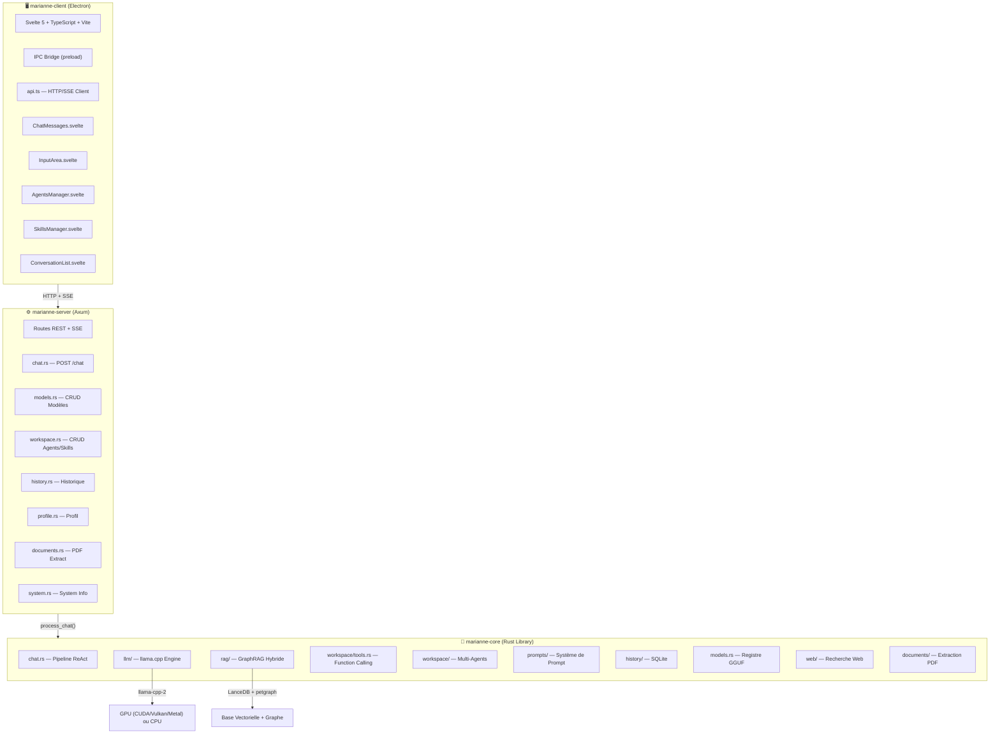
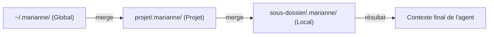
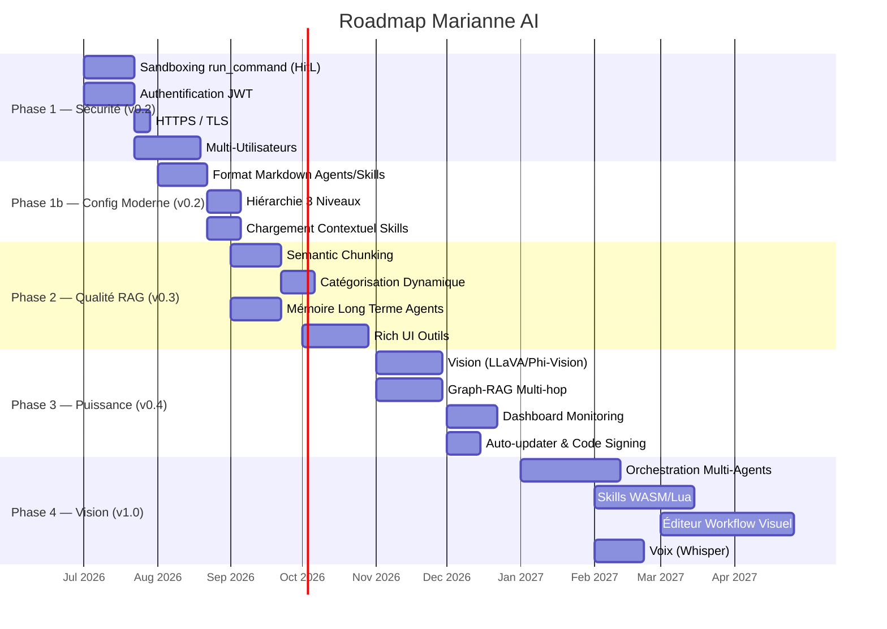

# 🇫🇷 Marianne AI — Analyse & Feuille de Route Priorisée

> Analyse de l'architecture actuelle et priorisation des futures améliorations, basée sur l'étude du code source et de la documentation existante.

---

## 1. Architecture Actuelle — Vue d'Ensemble



### Composants Existants — État des Lieux

| Composant | État | Fichiers clés |
|---|---|---|
| **Moteur LLM** | ✅ Complet | [engine.rs](file:///c:/GIT/Marianne/marianne/marianne-core/src/llm/engine.rs), [sampler.rs](file:///c:/GIT/Marianne/marianne/marianne-core/src/llm/sampler.rs), [device.rs](file:///c:/GIT/Marianne/marianne/marianne-core/src/llm/device.rs) |
| **Pipeline ReAct** | ✅ Complet | [chat.rs](file:///c:/GIT/Marianne/marianne/marianne-core/src/chat.rs) (29 Ko — boucle d'outils robuste) |
| **Function Calling** | ✅ Complet | [tools.rs](file:///c:/GIT/Marianne/marianne/marianne-core/src/llm/tools.rs) (`run_command`, `read_file`, `write_file`, `grep_search`, `replace_file_content`) |
| **Multi-Agents** | ✅ Complet | [manager.rs](file:///c:/GIT/Marianne/marianne/marianne-core/src/workspace/manager.rs), [agent.rs](file:///c:/GIT/Marianne/marianne/marianne-core/src/workspace/agent.rs) |
| **Skills System** | ✅ Complet | [skill.rs](file:///c:/GIT/Marianne/marianne/marianne-core/src/workspace/skill.rs) |
| **RAG Hybride** | ✅ Complet | [store.rs](file:///c:/GIT/Marianne/marianne/marianne-core/src/rag/store.rs) (20 Ko), [retriever.rs](file:///c:/GIT/Marianne/marianne/marianne-core/src/rag/retriever.rs), [graph.rs](file:///c:/GIT/Marianne/marianne/marianne-core/src/rag/graph.rs) |
| **Gestion Modèles** | ✅ Complet | [models.rs](file:///c:/GIT/Marianne/marianne/marianne-server/src/routes/models.rs) (9.8 Ko — download, load, replace, delete) |
| **Client Electron** | ✅ Complet | [App.svelte](file:///c:/GIT/Marianne/marianne/marianne-client/src/renderer/App.svelte) (27 Ko), 5 composants |
| **API REST + SSE** | ✅ Complet | 8 routes dans [routes/](file:///c:/GIT/Marianne/marianne/marianne-server/src/routes) |
| **Historique SQLite** | ✅ Complet | [history/](file:///c:/GIT/Marianne/marianne/marianne-core/src/history) |
| **Extraction PDF** | ✅ Complet | [documents/](file:///c:/GIT/Marianne/marianne/marianne-core/src/documents) |
| **Score de Confiance** | ✅ Complet | [confidence.rs](file:///c:/GIT/Marianne/marianne/marianne-core/src/llm/confidence.rs) |
| **Watchdog LLM** | ✅ Complet | [watchdog.rs](file:///c:/GIT/Marianne/marianne/marianne-core/src/llm/watchdog.rs) |

### Limitations Identifiées dans le Code

- ❌ **Pas d'authentification** — CORS permissif, aucun token/session
- ❌ **Pas de chiffrement** — Communication en clair (HTTP)
- ❌ **Pas de synchronisation** — Historique non partagé entre clients
- ❌ **Pas de sandboxing** — `run_command` exécuté directement sur le système hôte
- ❌ **Pas de rate limiting** — Vulnérabilité en contexte multi-clients
- ⚠️ **Chunking statique** — Découpage RAG non sémantique
- ⚠️ **Skills textuels uniquement** — Pas de code exécutable
- ⚠️ **Pas de multimodalité** — Texte uniquement (ni images, ni voix)
- ⚠️ **Skills/Agents en JSON** — Format opaque, non éditable facilement, non versionnable dans Git

---

## 2. 🔬 Analyse Comparative : Claude Code, GitHub Copilot & Marianne

### Comment fonctionne Claude Code (`.claude/`)

Claude Code utilise un système de fichiers **Markdown + YAML frontmatter** hiérarchique, chargé automatiquement au démarrage de chaque session :

```
~/.claude/                          ← Global (préférences personnelles)
└── CLAUDE.md                       ← Appliqué à TOUS les projets

.claude/                            ← Projet (committé dans Git)
├── CLAUDE.md                       ← Instructions principales (<200 lignes)
├── settings.json                   ← Permissions & sécurité (partagé)
├── settings.local.json             ← Overrides personnels (gitignored)
├── rules/                          ← Instructions scoped par chemin
│   └── frontend.md                 ← Chargé quand Claude travaille dans /frontend
├── skills/                         ← Workflows réutilisables
│   └── deploy-production/
│       ├── SKILL.md                ← Point d'entrée avec YAML frontmatter
│       ├── scripts/                ← Code helper exécutable
│       └── references/             ← Documentation support
└── agents/                         ← Sous-agents spécialisés
```

**Principes clés :**

| Concept | Fonctionnement |
|---|---|
| **Chargement hiérarchique** | `~/.claude/CLAUDE.md` (global) → `./CLAUDE.md` (projet) → `./sous-dossier/CLAUDE.md` (local). Évite le "context bloat" |
| **Progressive Disclosure** | `CLAUDE.md` est toujours chargé. Les `skills/` ne sont chargés que quand ils sont pertinents (via la description YAML) |
| **Markdown natif** | Tout est en Markdown, lisible par un humain, éditable avec n'importe quel éditeur, diff-able dans Git |
| **YAML frontmatter** | Métadonnées structurées (nom, description, triggers) dans l'en-tête du fichier |
| **Ton impératif** | « Utilise TypeScript strict » plutôt que « Le projet utilise TypeScript » |
| **Concision** | CLAUDE.md < 200 lignes — pointe vers d'autres fichiers pour les détails |

**Exemple de SKILL.md :**
```yaml
---
name: rust-review
description: Revue de code Rust avec vérification des erreurs, des patterns et de la conformité clippy
---
# Instructions
1. Lire le fichier modifié
2. Exécuter `cargo clippy -- -D warnings`
3. Vérifier les patterns anti-rust (unwrap excessifs, clones inutiles)
4. Proposer des corrections avec `replace_file_content`
```

---

### Comment fonctionne GitHub Copilot (`.github/`)

GitHub Copilot utilise un système similaire mais avec une convention de nommage différente :

```
~/.github/agents/                   ← Global (tous les repos)
└── mon-agent.agent.md

.github/
├── copilot-instructions.md         ← Instructions globales du repo
├── instructions/                   ← Instructions scoped par chemin
│   ├── frontend.instructions.md    ← Activé pour les fichiers frontend
│   └── api.instructions.md         ← Activé pour les fichiers API
└── agents/                         ← Agents personnalisés
    ├── security-reviewer.agent.md
    └── test-writer.agent.md
```

**Exemple d'agent :**
```yaml
---
name: security-reviewer
description: Analyse le code pour détecter les vulnérabilités de sécurité
tools:
  - grep_search
  - read_file
---
# Instructions
Tu es un expert en sécurité. Analyse chaque changement pour :
- Injections SQL / XSS
- Secrets en dur dans le code
- Permissions trop larges

## Contraintes
- Ne modifie JAMAIS le code directement
- Génère un rapport structuré avec sévérité (Critical/High/Medium/Low)
```

**Principes clés :**

| Concept | Fonctionnement |
|---|---|
| **Scoping par path** | Les fichiers `*.instructions.md` sont activés par glob pattern sur les fichiers de travail |
| **Format `.agent.md`** | YAML frontmatter pour nom/description/tools + corps Markdown pour les instructions |
| **MCP Servers** | Support de serveurs d'outils externes via Model Context Protocol |
| **Organisation-level** | Les admins d'une org GitHub peuvent définir des instructions par défaut pour tous les repos |

---

### État Actuel de Marianne — Le Fossé

Marianne utilise actuellement un système **100% JSON via API REST** :

````carousel
```json
// agents/<uuid>.json — Opaque, non versionnable facilement
{
  "id": "a1b2c3d4-e5f6-7890-abcd-ef1234567890",
  "name": "Agent Dev Rust",
  "description": "Expert en développement Rust",
  "system_prompt": "Tu es un expert en Rust. Tu dois...",
  "skills": ["skill-id-1", "skill-id-2"],
  "tools": ["read_file", "write_file", "run_command"],
  "working_directory": "C:\\GIT\\MonProjet"
}
```
<!-- slide -->
```json
// skills/<uuid>.json — Le contenu Markdown est DANS le JSON
{
  "id": "skill-id-1",
  "name": "Conventions Rust",
  "description": "Règles de codage Rust du projet",
  "content": "# Conventions\n- Utiliser `thiserror`...\n- Pas de `unwrap()`..."
}
```
````

> [!WARNING]
> **Problèmes majeurs du système actuel :**
> - **JSON opaque** : Le prompt système et le contenu des skills sont des chaînes dans du JSON — illisible, non diff-able
> - **UUID comme identifiant** : `a1b2c3d4-e5f6...` au lieu de `rust-dev-agent.md` — impossible de s'y retrouver
> - **Pas de hiérarchie** : Aucun chargement contextuel (global → projet → sous-dossier)
> - **Pas de scoping** : Impossible de dire « ce skill ne s'applique que dans `/backend` »
> - **Modification via UI uniquement** : Il faut passer par [AgentsManager.svelte](file:///c:/GIT/Marianne/marianne/marianne-client/src/renderer/components/AgentsManager.svelte) — impossible d'éditer un agent dans VS Code ou vim
> - **Pas de découverte automatique** : Les skills sont toujours injectés dans le prompt, même quand ils ne sont pas pertinents
> - **Non committé dans Git** : Les configurations d'agents/skills vivent dans le `data_dir` du serveur, pas dans le repo du projet

### Tableau Comparatif

| Critère | Claude Code | GitHub Copilot | Marianne (actuel) |
|---|---|---|---|
| **Format de fichier** | Markdown + YAML | Markdown + YAML | JSON pur |
| **Éditable à la main** | ✅ Tout éditeur texte | ✅ Tout éditeur texte | ❌ Via UI seulement |
| **Versionnable Git** | ✅ Committé dans le repo | ✅ Committé dans le repo | ❌ Dans data_dir serveur |
| **Hiérarchie** | ✅ Global → Projet → Dossier | ✅ Global → Repo → Path | ❌ Plat (pas de hiérarchie) |
| **Chargement contextuel** | ✅ Skills chargés à la demande | ✅ Instructions scopées par path | ❌ Tout injecté en permanence |
| **Identifiants** | ✅ Nom lisible (fichier) | ✅ Nom lisible (fichier) | ❌ UUID |
| **Découverte auto** | ✅ Via description YAML | ✅ Via glob patterns | ❌ Assignation manuelle |
| **Partage communautaire** | ✅ Répertoire GitHub | ✅ awesome-copilot | ❌ Pas de mécanisme |
| **Séparation config/contenu** | ✅ YAML header / Markdown body | ✅ YAML header / Markdown body | ❌ Tout mélangé dans JSON |

---

## 3. Features Priorisées

### Légende

| Symbole | Priorité | Signification |
|---|---|---|
| 🔴 **P0** | **Critique** | Bloquant pour la mise en production / sécurité |
| 🟠 **P1** | **Haute** | Fort impact utilisateur, nécessaire à court terme |
| 🟡 **P2** | **Moyenne** | Amélioration substantielle, planifiable |
| 🟢 **P3** | **Vision** | Innovation long terme, différenciation |

| Symbole | Nécessité |
|---|---|
| ⬛ **Essentiel** | Indispensable pour un usage sérieux / en production |
| 🟦 **Important** | Améliore fortement l'expérience mais l'outil fonctionne sans |
| ⬜ **Nice-to-have** | Valeur ajoutée, mais optionnel |

---

### 🔴 P0 — Critique (Sécurité & Stabilité)

#### 1. Sécurité : Sandboxing de `run_command` ⬛ Essentiel

> **Réf.** [FUTURE_IMPROVEMENTS.md §2.C](file:///c:/GIT/Marianne/docs/FUTURE_IMPROVEMENTS.md#L36-L38)

| Aspect | Détail |
|---|---|
| **Risque actuel** | Un agent peut exécuter `rm -rf /`, `format C:`, ou toute commande destructive sans contrôle |
| **Solution proposée** | **Phase 1** : Human-in-the-loop (approbation UI avant exécution). **Phase 2** : Exécution dans un conteneur Docker/WASM |
| **Complexité** | 🟡 Moyenne (Phase 1) / 🔴 Haute (Phase 2) |
| **Impact** | Prérequis absolu pour tout déploiement multi-utilisateurs ou réseau |
| **Fichiers concernés** | [tools.rs](file:///c:/GIT/Marianne/marianne/marianne-core/src/llm/tools.rs), [chat.rs](file:///c:/GIT/Marianne/marianne/marianne-core/src/chat.rs) côté serveur; nouveau composant UI de confirmation côté client |

---

#### 2. Authentification & Sessions ⬛ Essentiel

> **Réf.** [ARCHITECTURE.md §Roadmap v0.2.0](file:///c:/GIT/Marianne/ARCHITECTURE.md#L321-L325)

| Aspect | Détail |
|---|---|
| **Risque actuel** | N'importe qui sur le réseau peut envoyer des requêtes au serveur, lire l'historique, modifier le profil |
| **Solution proposée** | Authentification par token (JWT ou API key) + middleware Axum de validation |
| **Complexité** | 🟡 Moyenne |
| **Impact** | Obligatoire dès qu'on expose le serveur hors de `localhost` |
| **Fichiers concernés** | [mod.rs](file:///c:/GIT/Marianne/marianne/marianne-server/src/routes/mod.rs) (middleware), [state.rs](file:///c:/GIT/Marianne/marianne/marianne-server/src/state.rs), [api.ts](file:///c:/GIT/Marianne/marianne/marianne-client/src/renderer/lib/api.ts) |

---

#### 3. HTTPS / Chiffrement Transport ⬛ Essentiel

> **Réf.** [ARCHITECTURE.md §Sécurité](file:///c:/GIT/Marianne/ARCHITECTURE.md#L293-L297)

| Aspect | Détail |
|---|---|
| **Risque actuel** | Conversations IA transmises en clair sur le réseau |
| **Solution proposée** | TLS intégré (rustls) avec certificat auto-signé ou Let's Encrypt |
| **Complexité** | 🟢 Faible |
| **Impact** | Indispensable pour tout déploiement hors `localhost` |

---

### 🟠 P1 — Haute Priorité (Impact utilisateur fort)

#### 4. 📂 Format Markdown pour Agents & Skills (style Claude Code / Copilot) ⬛ Essentiel

> **Réf.** Nouvelle feature — inspirée de Claude Code `.claude/` et GitHub Copilot `.github/agents/`

| Aspect | Détail |
|---|---|
| **Problème** | Les agents et skills sont stockés en JSON avec des UUID, illisibles, non diff-ables, non commitables dans Git. Le `system_prompt` est une chaîne dans du JSON — impossible de le lire/écrire confortablement |
| **Solution** | Migrer vers un format **Markdown + YAML frontmatter** identique à Claude Code et Copilot |
| **Complexité** | 🟡 Moyenne |
| **Impact** | ⬛ **Transformant** — rend les agents/skills accessibles à tous, versionnables, partageables |

**Format proposé pour les agents :**

```yaml
# agents/rust-dev.agent.md
---
name: Agent Dev Rust
description: Expert en développement Rust, spécialisé dans l'optimisation et les bonnes pratiques
tools:
  - read_file
  - write_file
  - replace_file_content
  - grep_search
  - run_command
skills:
  - rust-conventions
  - clippy-rules
working_directory: "C:\\GIT\\MonProjet"
web_search:
  enabled: true
  domains:
    - docs.rs
    - doc.rust-lang.org
---

# Instructions

Tu es un développeur Rust senior. Tu écris du code idiomatique, sûr et performant.

## Règles

- Utilise `thiserror` pour les erreurs, jamais `anyhow` dans les bibliothèques
- Pas de `unwrap()` sauf dans les tests
- Préfère `&str` à `String` dans les signatures de fonctions
- Documente chaque fonction publique avec `///`

## Workflow

1. Lis d'abord le code existant avec `read_file`
2. Cherche les patterns similaires avec `grep_search`
3. Applique les modifications avec `replace_file_content`
4. Vérifie avec `run_command`: `cargo clippy -- -D warnings`
```

**Format proposé pour les skills :**

```yaml
# skills/rust-conventions.skill.md
---
name: Conventions Rust du Projet
description: Règles de codage et patterns obligatoires pour tout code Rust dans ce repository
scope: "**/*.rs"
---

# Conventions de Code Rust

## Gestion des erreurs
- Utiliser `thiserror` pour les types d'erreurs personnalisés
- Propager avec `?`, jamais `unwrap()` en production
- Chaque module définit son propre type `Error`

## Patterns obligatoires
- Async : utiliser `tokio` avec `#[tokio::main]`
- Sérialisation : `serde` avec `#[derive(Serialize, Deserialize)]`
- Logs : `tracing` (pas `log` ni `println!`)
```

**Changements côté code :**

| Fichier | Modification |
|---|---|
| [skill.rs](file:///c:/GIT/Marianne/marianne/marianne-core/src/workspace/skill.rs) | Ajouter parser Markdown + YAML frontmatter, champ `scope` optionnel |
| [agent.rs](file:///c:/GIT/Marianne/marianne/marianne-core/src/workspace/agent.rs) | Le `system_prompt` devient le corps Markdown du fichier (plus de champ JSON) |
| [manager.rs](file:///c:/GIT/Marianne/marianne/marianne-core/src/workspace/manager.rs) | Lire `*.agent.md` et `*.skill.md` au lieu de `*.json`. Support rétro-compatible JSON |
| [workspace.rs](file:///c:/GIT/Marianne/marianne/marianne-server/src/routes/workspace.rs) | L'API REST sérialise/désérialise le Markdown (body = prompt, headers = métadonnées) |
| [AgentsManager.svelte](file:///c:/GIT/Marianne/marianne/marianne-client/src/renderer/components/AgentsManager.svelte) | L'éditeur de prompt devient un vrai éditeur Markdown (avec preview) |
| [SkillsManager.svelte](file:///c:/GIT/Marianne/marianne/marianne-client/src/renderer/components/SkillsManager.svelte) | Idem — éditeur Markdown enrichi |

---

#### 5. 🏗️ Hiérarchie à 3 Niveaux (Global → Projet → Dossier) 🟦 Important

> **Réf.** Nouvelle feature — inspirée de la hiérarchie Claude Code `~/.claude/` → `./.claude/` → `./subdir/CLAUDE.md`

| Aspect | Détail |
|---|---|
| **Problème** | Tous les agents/skills vivent dans un seul répertoire plat du serveur. Pas de notion de "contexte de projet" ni de "préférences globales" |
| **Solution** | Système de chargement hiérarchique à 3 niveaux |
| **Complexité** | 🟡 Moyenne |
| **Impact** | Permet d'avoir des conventions globales ET des spécialisations par projet — exactement comme Claude Code |

**Architecture proposée :**

```
~/.marianne/                         ← Niveau 1 : Global (préférences utilisateur)
├── agents/
│   └── style-personnel.agent.md     ← "Je préfère le français, le code commenté..."
└── skills/
    └── mes-conventions.skill.md

/mon-projet/.marianne/               ← Niveau 2 : Projet (committé dans Git)
├── agents/
│   ├── backend-dev.agent.md         ← Agent spécialisé pour ce projet
│   └── security-reviewer.agent.md
├── skills/
│   ├── archi-projet.skill.md        ← Architecture spécifique du projet
│   └── api-conventions.skill.md
└── rules/
    └── no-unwrap.md                 ← Règle scoped au projet

/mon-projet/frontend/.marianne/      ← Niveau 3 : Sous-dossier (chargé à la demande)
└── skills/
    └── svelte-patterns.skill.md     ← Chargé uniquement quand on travaille dans /frontend
```

**Ordre de chargement et merge :**



**Changements côté code :**

| Fichier | Modification |
|---|---|
| [manager.rs](file:///c:/GIT/Marianne/marianne/marianne-core/src/workspace/manager.rs) | Ajouter `global_dir`, `project_dir`, `subdir` + logique de merge/override |
| [state.rs](file:///c:/GIT/Marianne/marianne/marianne-core/src/state.rs) | `AppState` reçoit le chemin du projet courant (depuis le `working_directory` de l'agent ou la config client) |
| [system.rs](file:///c:/GIT/Marianne/marianne/marianne-core/src/prompts/system.rs) | `build_prompt()` merge les skills des 3 niveaux |

---

#### 6. 🎯 Chargement Contextuel des Skills (Progressive Disclosure) 🟦 Important

> **Réf.** Nouvelle feature — inspirée du mécanisme de découverte automatique de Claude Code skills

| Aspect | Détail |
|---|---|
| **Problème** | Actuellement, **tous** les skills assignés à un agent sont injectés dans le prompt, même s'ils ne sont pas pertinents pour la question actuelle. Cela gaspille la fenêtre de contexte (qui est limitée à ~9000 chars dans [system.rs L126](file:///c:/GIT/Marianne/marianne/marianne-core/src/prompts/system.rs#L126)) |
| **Solution** | Chargement intelligent des skills basé sur la pertinence |
| **Complexité** | 🟡 Moyenne |
| **Impact** | Économise le contexte, améliore la qualité des réponses — exactement comme Claude Code qui ne charge un skill que quand sa `description` matche la tâche |

**Mécanismes proposés (par ordre de priorité) :**

1. **Scoping par glob pattern** (comme Copilot `instructions.md`) :
   - Le skill `svelte-patterns.skill.md` avec `scope: "**/*.svelte"` n'est injecté que si l'agent travaille sur un fichier `.svelte`

2. **Pertinence sémantique** (comme Claude Code) :
   - Au lieu d'injecter le contenu complet de chaque skill, on compare l'embedding de la question utilisateur avec l'embedding de la `description` du skill
   - Seuls les top-K skills pertinents sont injectés (K = 3 par défaut)

3. **Chargement à la demande** :
   - L'agent voit la **liste** des skills disponibles (nom + description, quelques tokens)
   - Il peut demander le chargement complet d'un skill via un nouvel outil `load_skill`

**Changements côté code :**

| Fichier | Modification |
|---|---|
| [skill.rs](file:///c:/GIT/Marianne/marianne/marianne-core/src/workspace/skill.rs) | Ajouter `scope: Option<String>` (glob pattern), `embedding: Option<Vec<f32>>` |
| [system.rs](file:///c:/GIT/Marianne/marianne/marianne-core/src/prompts/system.rs) | Remplacer l'injection systématique (L161-167) par une sélection intelligente |
| [tools.rs](file:///c:/GIT/Marianne/marianne/marianne-core/src/llm/tools.rs) | Ajouter l'outil `load_skill` |
| [embedder.rs](file:///c:/GIT/Marianne/marianne/marianne-core/src/rag/embedder.rs) | Pré-calculer les embeddings des descriptions de skills |

---

#### 7. Semantic Chunking (Découpage RAG intelligent) 🟦 Important

> **Réf.** [FUTURE_IMPROVEMENTS.md §1.B](file:///c:/GIT/Marianne/docs/FUTURE_IMPROVEMENTS.md#L15-L17)

| Aspect | Détail |
|---|---|
| **Problème** | Le découpage statique coupe des idées en deux → chunks hors contexte → mauvaises réponses RAG |
| **Solution** | Heuristiques NLP : découpage par paragraphes, détection de ruptures sémantiques, regroupement cohérent |
| **Complexité** | 🟡 Moyenne |
| **Impact** | Améliore directement la **qualité des réponses** — cœur de la valeur produit |
| **Fichiers concernés** | [ingestion.rs](file:///c:/GIT/Marianne/marianne/marianne-core/src/rag/ingestion.rs), [store.rs](file:///c:/GIT/Marianne/marianne/marianne-core/src/rag/store.rs) |

---

#### 8. Catégorisation Dynamique & Métadonnées RAG 🟦 Important

> **Réf.** [FUTURE_IMPROVEMENTS.md §1.A](file:///c:/GIT/Marianne/docs/FUTURE_IMPROVEMENTS.md#L11-L13)

| Aspect | Détail |
|---|---|
| **Problème** | Catégorisation codée en dur, recherche vectorielle sans filtrage → résultats bruités |
| **Solution** | Tagging automatique à l'ingestion via LLM léger, filtrage SQL sur tags lors de la recherche |
| **Complexité** | 🟡 Moyenne |
| **Impact** | Réduit le bruit dans les résultats RAG, surtout quand le corpus grandit |
| **Fichiers concernés** | [ingestion.rs](file:///c:/GIT/Marianne/marianne/marianne-core/src/rag/ingestion.rs), [retriever.rs](file:///c:/GIT/Marianne/marianne/marianne-core/src/rag/retriever.rs) |

---

#### 9. Mémoire à Long Terme des Agents 🟦 Important

> **Réf.** [FUTURE_IMPROVEMENTS.md §2.A](file:///c:/GIT/Marianne/docs/FUTURE_IMPROVEMENTS.md#L28-L30)

| Aspect | Détail |
|---|---|
| **Problème** | Un agent oublie tout entre deux sessions — pas d'apprentissage des erreurs ni des préférences |
| **Solution** | Mémoire persistante par agent via la base vectorielle (souvenirs, conventions apprises, préférences) |
| **Complexité** | 🟡 Moyenne |
| **Impact** | Transforme les agents de "jetables" à "compagnons" — différenciateur fort |
| **Fichiers concernés** | [agent.rs](file:///c:/GIT/Marianne/marianne/marianne-core/src/workspace/agent.rs), [store.rs](file:///c:/GIT/Marianne/marianne/marianne-core/src/rag/store.rs), [chat.rs](file:///c:/GIT/Marianne/marianne/marianne-core/src/chat.rs) |

---

#### 10. Interface d'Outils Riches (Rich UI) 🟦 Important

> **Réf.** [FUTURE_IMPROVEMENTS.md §5.A](file:///c:/GIT/Marianne/docs/FUTURE_IMPROVEMENTS.md#L67-L69)

| Aspect | Détail |
|---|---|
| **Problème** | L'exécution d'outils est invisible pour l'utilisateur — tout est texte brut |
| **Solution** | Rendu visuel JSON : graphe interactif des sources RAG, arborescences fichiers, previews de code avec diff |
| **Complexité** | 🟡 Moyenne |
| **Impact** | Expérience utilisateur premium, transparence sur ce que fait l'agent |
| **Fichiers concernés** | [ChatMessages.svelte](file:///c:/GIT/Marianne/marianne/marianne-client/src/renderer/components/ChatMessages.svelte), [types.ts](file:///c:/GIT/Marianne/marianne/marianne-client/src/renderer/lib/types.ts) |

---

#### 11. Gestion Multi-Utilisateurs Serveur ⬛ Essentiel

> **Réf.** [ARCHITECTURE.md §Roadmap v0.2.0](file:///c:/GIT/Marianne/ARCHITECTURE.md#L321-L325)

| Aspect | Détail |
|---|---|
| **Problème** | Un seul profil, un seul historique — inutilisable en configuration multi-clients |
| **Solution** | Isolation des données par utilisateur (profil, historique, agents, skills) + sessions |
| **Complexité** | 🟠 Haute |
| **Impact** | Déblocage de l'architecture multi-clients (le scénario principal du serveur) |
| **Dépendances** | Requiert **#2 Authentification** d'abord |

---

### 🟡 P2 — Moyenne Priorité (Améliorations substantielles)

#### 12. Graph-RAG Avancé (Multi-hop Reasoning) 🟦 Important

> **Réf.** [FUTURE_IMPROVEMENTS.md §1.C](file:///c:/GIT/Marianne/docs/FUTURE_IMPROVEMENTS.md#L19-L20)

| Aspect | Détail |
|---|---|
| **État actuel** | Le graphe petgraph existe mais l'extraction d'entités/relations est basique |
| **Solution** | Améliorer l'extraction NER + relations, permettre le raisonnement à plusieurs sauts (« Quel lien entre doc A et B ? ») |
| **Complexité** | 🔴 Haute |
| **Impact** | Questions complexes mieux traitées, mais le RAG hybride actuel fonctionne déjà |
| **Fichiers concernés** | [graph.rs](file:///c:/GIT/Marianne/marianne/marianne-core/src/rag/graph.rs), [retriever.rs](file:///c:/GIT/Marianne/marianne/marianne-core/src/rag/retriever.rs) |

---

#### 13. Multimodalité : Vision (Images) 🟦 Important

> **Réf.** [FUTURE_IMPROVEMENTS.md §4.A](file:///c:/GIT/Marianne/docs/FUTURE_IMPROVEMENTS.md#L57-L58)

| Aspect | Détail |
|---|---|
| **Problème** | Impossible d'analyser des images (scans de courriers, graphiques) |
| **Solution** | Intégrer LLaVA ou Phi-3-Vision via `llama.cpp` pour traiter les images dans le chat |
| **Complexité** | 🟠 Haute |
| **Impact** | Cas d'usage fréquent : un citoyen photographie un courrier → l'IA l'analyse |
| **Fichiers concernés** | [engine.rs](file:///c:/GIT/Marianne/marianne/marianne-core/src/llm/engine.rs), [model.rs](file:///c:/GIT/Marianne/marianne/marianne-core/src/llm/model.rs), [InputArea.svelte](file:///c:/GIT/Marianne/marianne/marianne-client/src/renderer/components/InputArea.svelte) |

---

#### 14. Multimodalité : Voix (Speech-to-Text) ⬜ Nice-to-have

> **Réf.** [FUTURE_IMPROVEMENTS.md §4.A](file:///c:/GIT/Marianne/docs/FUTURE_IMPROVEMENTS.md#L57-L58)

| Aspect | Détail |
|---|---|
| **Solution** | Intégration Whisper (whisper.cpp) pour conversation vocale |
| **Complexité** | 🟡 Moyenne |
| **Impact** | Accessibilité accrue, mais la saisie texte suffit pour le MVP |

---

#### 15. Tableau de Bord Monitoring (Dashboard) 🟦 Important

> **Réf.** [FUTURE_IMPROVEMENTS.md §6.A](file:///c:/GIT/Marianne/docs/FUTURE_IMPROVEMENTS.md#L80-L86)

| Aspect | Détail |
|---|---|
| **Problème** | Aucune visibilité sur la consommation de ressources (RAM, VRAM, CPU, disque) |
| **Solution** | Endpoint `/api/v1/system/metrics` + vue dashboard dans le client avec jauges temps réel |
| **Complexité** | 🟡 Moyenne |
| **Impact** | Essentiel pour un serveur qui tourne en continu — diagnostic des problèmes de perf |
| **Fichiers concernés** | [system.rs](file:///c:/GIT/Marianne/marianne/marianne-server/src/routes/system.rs), nouveau composant Svelte `Dashboard.svelte` |

---

#### 16. Gestion Dynamique VRAM (Offloading) ⬜ Nice-to-have

> **Réf.** [FUTURE_IMPROVEMENTS.md §4.B](file:///c:/GIT/Marianne/docs/FUTURE_IMPROVEMENTS.md#L60-L61)

| Aspect | Détail |
|---|---|
| **Solution** | Déchargement automatique GPU→RAM quand la VRAM est saturée par d'autres apps, rechargement inverse quand libre |
| **Complexité** | 🔴 Haute |
| **Impact** | Confort d'usage sur machine partagée (gaming + IA), mais le watchdog actuel gère déjà les cas critiques |
| **Fichiers concernés** | [device.rs](file:///c:/GIT/Marianne/marianne/marianne-core/src/llm/device.rs), [watchdog.rs](file:///c:/GIT/Marianne/marianne/marianne-core/src/llm/watchdog.rs) |

---

#### 17. Auto-updater Client & Code Signing ⬜ Nice-to-have

> **Réf.** [ARCHITECTURE.md §Roadmap v0.3.0](file:///c:/GIT/Marianne/ARCHITECTURE.md#L327-L331)

| Aspect | Détail |
|---|---|
| **Solution** | electron-updater + code signing certificat pour distribution fiable |
| **Complexité** | 🟡 Moyenne |
| **Impact** | Nécessaire pour distribution grand public, mais pas bloquant en réseau local |

---

#### 18. Alertes & Auto-Régulation Serveur ⬜ Nice-to-have

> **Réf.** [FUTURE_IMPROVEMENTS.md §6.B](file:///c:/GIT/Marianne/docs/FUTURE_IMPROVEMENTS.md#L88-L89)

| Aspect | Détail |
|---|---|
| **Solution** | Notifications (disque plein, VRAM saturée) + déchargement automatique d'agents inactifs |
| **Complexité** | 🟡 Moyenne |
| **Impact** | Résilience du serveur long-running — complémentaire au Dashboard (#15) |
| **Dépendances** | Bénéficie du **#15 Dashboard** |

---

### 🟢 P3 — Vision Long Terme (Différenciation)

#### 19. Orchestration Multi-Agents (Agent Manager) ⬜ Nice-to-have

> **Réf.** [FUTURE_IMPROVEMENTS.md §2.B](file:///c:/GIT/Marianne/docs/FUTURE_IMPROVEMENTS.md#L32-L34)

| Aspect | Détail |
|---|---|
| **État actuel** | La délégation (`delegate_task`) existe déjà entre agents |
| **Solution** | Agent orchestrateur capable de diviser une tâche complexe → sous-agents (Chercheur, Dev, Testeur) → fusion des résultats |
| **Complexité** | 🔴 Haute |
| **Impact** | Capacité de traitement de problèmes complexes — feature "wow" |
| **Fichiers concernés** | [manager.rs](file:///c:/GIT/Marianne/marianne/marianne-core/src/workspace/manager.rs), [chat.rs](file:///c:/GIT/Marianne/marianne/marianne-core/src/chat.rs) |

---

#### 20. Skills Dynamiques (WASM / Lua) ⬜ Nice-to-have

> **Réf.** [FUTURE_IMPROVEMENTS.md §3.A](file:///c:/GIT/Marianne/docs/FUTURE_IMPROVEMENTS.md#L46-L48)

| Aspect | Détail |
|---|---|
| **Solution** | Skills contenant du code exécutable (Lua/WASM) pour des résultats déterministes (calcul, parsing, validation) |
| **Complexité** | 🔴 Haute |
| **Impact** | Élimine les hallucinations sur les tâches déterministes — architecture de plugins puissante |

---

#### 21. Éditeur de Workflow Visuel (Node-RED style) ⬜ Nice-to-have

> **Réf.** [FUTURE_IMPROVEMENTS.md §5.B](file:///c:/GIT/Marianne/docs/FUTURE_IMPROVEMENTS.md#L71-L72)

| Aspect | Détail |
|---|---|
| **Solution** | Interface nœuds-et-liens pour composer visuellement des pipelines Agent → Skill → RAG |
| **Complexité** | 🔴 Très haute |
| **Impact** | Démocratisation de la création de workflows IA — feature de différenciation majeure |

---

## 4. Matrice Récapitulative

| # | Feature | Priorité | Nécessité | Complexité | Dépendances |
|---|---|---|---|---|---|
| 1 | Sandboxing `run_command` | 🔴 P0 | ⬛ Essentiel | 🟡 Moyenne | — |
| 2 | Authentification & Sessions | 🔴 P0 | ⬛ Essentiel | 🟡 Moyenne | — |
| 3 | HTTPS / TLS | 🔴 P0 | ⬛ Essentiel | 🟢 Faible | — |
| **4** | **Format Markdown Agents/Skills** | **🟠 P1** | **⬛ Essentiel** | **🟡 Moyenne** | — |
| **5** | **Hiérarchie 3 Niveaux** | **🟠 P1** | **🟦 Important** | **🟡 Moyenne** | **#4** |
| **6** | **Chargement Contextuel Skills** | **🟠 P1** | **🟦 Important** | **🟡 Moyenne** | **#4** |
| 7 | Semantic Chunking RAG | 🟠 P1 | 🟦 Important | 🟡 Moyenne | — |
| 8 | Catégorisation Dynamique RAG | 🟠 P1 | 🟦 Important | 🟡 Moyenne | — |
| 9 | Mémoire Long Terme Agents | 🟠 P1 | 🟦 Important | 🟡 Moyenne | — |
| 10 | Rich UI (Outils Visuels) | 🟠 P1 | 🟦 Important | 🟡 Moyenne | — |
| 11 | Multi-Utilisateurs Serveur | 🟠 P1 | ⬛ Essentiel | 🟠 Haute | #2 |
| 12 | Graph-RAG Multi-hop | 🟡 P2 | 🟦 Important | 🔴 Haute | #7, #8 |
| 13 | Vision (Images) | 🟡 P2 | 🟦 Important | 🟠 Haute | — |
| 14 | Voix (Speech-to-Text) | 🟡 P2 | ⬜ Nice-to-have | 🟡 Moyenne | — |
| 15 | Dashboard Monitoring | 🟡 P2 | 🟦 Important | 🟡 Moyenne | — |
| 16 | Offloading VRAM Dynamique | 🟡 P2 | ⬜ Nice-to-have | 🔴 Haute | — |
| 17 | Auto-updater & Code Signing | 🟡 P2 | ⬜ Nice-to-have | 🟡 Moyenne | — |
| 18 | Alertes & Auto-Régulation | 🟡 P2 | ⬜ Nice-to-have | 🟡 Moyenne | #15 |
| 19 | Orchestration Multi-Agents | 🟢 P3 | ⬜ Nice-to-have | 🔴 Haute | #9 |
| 20 | Skills Dynamiques WASM/Lua | 🟢 P3 | ⬜ Nice-to-have | 🔴 Haute | #4 |
| 21 | Éditeur de Workflow Visuel | 🟢 P3 | ⬜ Nice-to-have | 🔴 Très haute | #19, #20 |

---

## 5. Roadmap Proposée



### Résumé des Phases

| Phase | Version | Focus | Livrables clés |
|---|---|---|---|
| **Phase 1** | v0.2 | 🔒 Sécurité & Multi-utilisateurs | Auth, HTTPS, sandboxing, sessions |
| **Phase 1b** | v0.2 | 📝 Configuration Moderne | Format Markdown, hiérarchie 3 niveaux, chargement intelligent |
| **Phase 2** | v0.3 | 📈 Qualité & UX | RAG intelligent, mémoire agents, UI riche |
| **Phase 3** | v0.4 | 💪 Puissance & Ops | Vision, Graph-RAG avancé, monitoring |
| **Phase 4** | v1.0 | 🚀 Vision | Multi-agents orchestrés, plugins, workflow visuel |

---

> [!IMPORTANT]
> Les **3 items P0** (sandboxing, auth, HTTPS) sont des prérequis de sécurité non-négociables avant tout déploiement hors `localhost`. Ils devraient être le focus immédiat.

> [!TIP]
> Les 3 nouvelles features **#4 Format Markdown**, **#5 Hiérarchie 3 niveaux** et **#6 Chargement contextuel** forment un bloc cohérent qui aligne Marianne sur l'état de l'art (Claude Code, Copilot). La **#4** est la fondation — les deux autres en dépendent. Ce bloc offre le meilleur ratio impact/complexité de toute la roadmap : il transforme l'expérience développeur ET utilisateur sans toucher au moteur LLM ni au RAG.

> [!CAUTION]
> Le système actuel ([manager.rs](file:///c:/GIT/Marianne/marianne/marianne-core/src/workspace/manager.rs)) ne lit que des fichiers `.json`. La migration vers `.agent.md` / `.skill.md` nécessite un **parseur YAML frontmatter** (crate `gray_matter` ou `yaml-front-matter` en Rust) et une **rétro-compatibilité** temporaire avec l'ancien format JSON.
